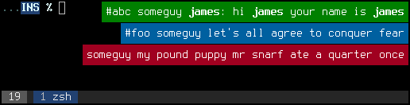

weechat-naughty-notifier is a script for [WeeChat][1] that displays
notifications via [Awesome][2]'s awesome-client(1) and [Naughty][3].
Configurable via [YAML][4].

[1]: http://www.weechat.org/
[2]: http://awesome.naquadah.org/
[3]: http://awesome.naquadah.org/wiki/Naughty
[4]: http://www.yaml.org/
